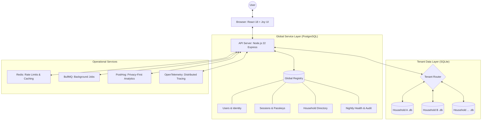

# Hearthstone Pro: Solution Architecture

Hearthstone is architected as a **Mission-Critical Multi-Tenant Household Management System**. It is designed for low-cost hardware (e.g., Raspberry Pi) or cloud containers while prioritizing strict data isolation, low latency, and comprehensive observability.

---

## 1. High-Level Topology



### Key Components

- **Frontend:** Single Page Application (SPA) built with React 18, utilizing **MUI Joy UI** for a design-system-first experience.
- **Backend:** Monolithic Node.js 22 process using Express. Optimized for performance with Gzip compression and strict payload limits.
- **Hybrid Storage:**
  - **PostgreSQL:** Centralized store for metadata, identity, and tenancy mapping. Managed via **Drizzle ORM**.
  - **SQLite:** Physical file-per-tenant isolation for all private household data. Ensures maximum privacy and easy portability.

---

## 2. Backend Design Patterns

### Middleware-Driven Context

The system uses a strict "Context Injection" pattern:

1. **Auth Middleware:** Verifies JWT or Clerk session.
2. **Tenant Middleware:** Inspects the `x-household-id` header and verifies the user has access via the Global Registry.
3. **Database Injection:** Dynamically opens/locates the correct SQLite file (`server/data/household-{id}.db`) and attaches the connection to `req.tenantDb`.

### Unified Error Handling (Item 85)

All errors are normalized through a centralized `AppError` class hierarchy, ensuring consistent API responses and proper logging with **Pino**.

### Idempotency & Safety (Item 104, 112)

- **Idempotency-Key:** All `POST`/`PUT` requests support idempotency keys to prevent duplicate processing on network retries.
- **Dry-Run:** Destructive or complex endpoints support a `x-dry-run` header to validate logic without committing changes to the database.

---

## 3. Frontend State & UI Architecture

### Server State (Item 12)

Managed exclusively via **TanStack Query (v5)**.

- **Key Factories:** Centralized query key management to prevent cache collisions.
- **Optimistic UI:** Targeted implementation for high-frequency actions like checking shopping items.

### Atomic Design System

Strict adherence to shared primitives in `web/src/components/ui/`:

- `<AppButton />`, `<AppInput />`, `<AppSelect />` wrap MUI Joy UI to enforce branding and accessibility standards.
- **Theme Engine v2:** Supports 50+ vibrant themes with dynamic HSL background generation for emojis.

---

## 4. Security & Isolation

### Multi-Tenancy Isolation (The Prime Directive)

Data isolation is enforced at the physical layer (separate SQLite files) and the application layer (middleware verification). User A cannot physically query User B's file because the file path is constructed from verified session data.

### Data Protection

- **Field-Level Encryption:** PII (Account numbers, DOBs) is encrypted at rest using AES-256-GCM.
- **Security Headers:** Strict **Content Security Policy (CSP)** and **CORS** whitelists are enforced from Day 1.
- **Deep Sanitization:** All incoming user input is recursively stripped of malicious HTML/JS via an `xss`-powered middleware.

---

## 5. Observability & Ops (Phase 6)

### Distributed Tracing (Item 148)

Integrated with **OpenTelemetry**. Every request is traced across Express, PostgreSQL, and Redis, providing deep visibility into latency bottlenecks.

### Real-time Telemetry

- **Core Web Vitals:** Frontend performance (LCP, FID, CLS) is beaconed to the backend to monitor real-user experience.
- **Memory Profiling:** Admin-only heap dump capability for diagnosing leaks in long-running Node processes.
- **Nightly Health:** A comprehensive verification suite runs every 24 hours, recording results to the global registry for dashboard visibility.

---

## 6. Directory Structure

```text
/
├── packages/shared/   # Unified Zod schemas, types, and error classes
├── server/            # Node.js Express Backend
│   ├── db/            # Postgres Schema & Drizzle config
│   ├── middleware/    # Security, Tenancy, and Validation
│   ├── routes/        # Domain-driven API endpoints
│   ├── services/      # Complex business logic (Analytics, Tracing, Jobs)
│   └── tests/         # Jest integration & containerized tests
├── web/               # React Frontend (Vite)
│   ├── src/features/  # Domain-specific views and components
│   ├── src/hooks/     # Reusable logic (Data fetching, Haptics)
│   └── src/theme/     # Joy UI theme extensions & Totem specs
└── scripts/           # DevOps automation & Nightly suite
```
