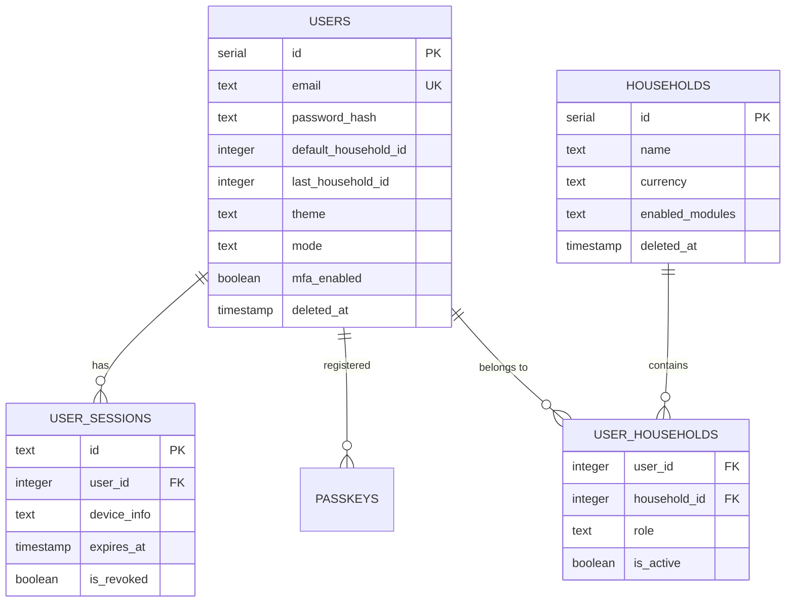
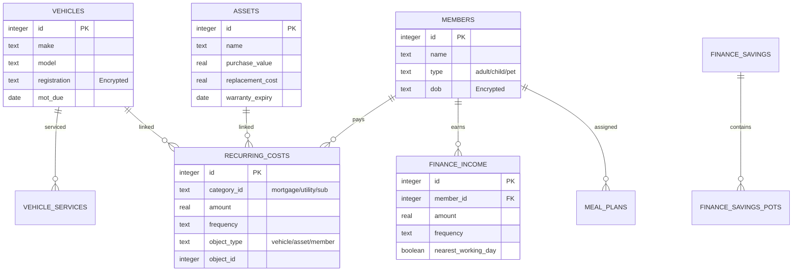

# Database Schema Reference

Hearthstone uses a **Hybrid Multi-Tenant Architecture** to balance global management with total tenant data privacy.

---

## 1. Global Registry (PostgreSQL)

The Global Registry handles identity, cross-household access, and system-wide orchestration.

---

## 2. Tenant Database (SQLite)

Each household has its own isolated `.db` file. This diagram represents the structure repeated for every tenant.

---

## 3. Data Protection Strategy

### Encrypted Fields (AES-256-GCM)

The following fields are encrypted at the application layer before being written to disk:

- **MEMBERS:** `dob`, `will_details`, `life_insurance_provider`.
- **VEHICLES:** `registration`.
- **ASSETS:** `serial_number`.
- **FINANCE_CURRENT_ACCOUNTS:** `account_number`, `sort_code`.

### Soft Deletes (Item 94)

Core entities include a `deleted_at` timestamp. Queries filter for `NULL` to prevent data loss while maintaining referential integrity for historical financial calculations.

### Postgres Enums (Item 95)

Status and Role columns in the Global Registry use native PostgreSQL `ENUM` types to prevent invalid state transitions.

- `system_role`: `['admin', 'user']`
- `user_role`: `['admin', 'member', 'viewer']`
- `theme_mode`: `['light', 'dark', 'system']`
